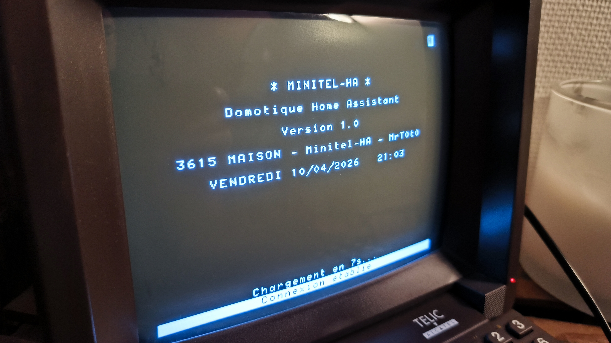
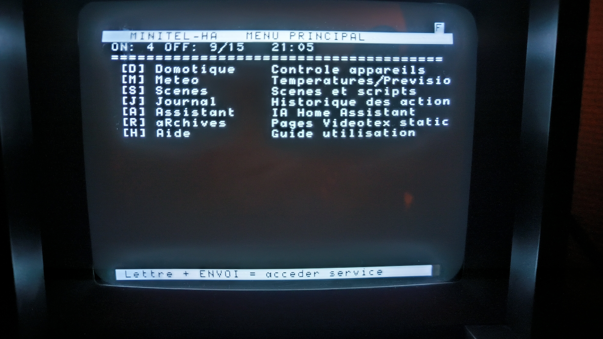
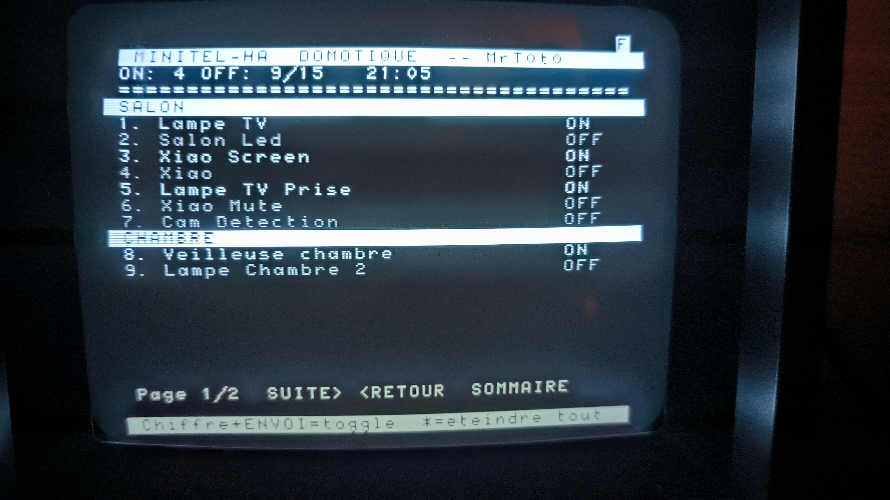

# Minitel-HA — 3615 MAISON

**Language / Langue:** [🇫🇷 Français](#français) | [🇬🇧 English](#english)

**Contrôlez Home Assistant depuis un vrai Minitel (ou un navigateur web) en Vidéotex.**  
**Control Home Assistant from a real Minitel terminal (or a web browser) using Videotex.**

[](https://github.com/Mrt0t0/Minitel-HA)
[](https://www.python.org/)
[](https://www.docker.com/)
[](LICENSE)

---

## Français

## Aperçu

<p align="center">
  
  
  
</p>

## Description

Minitel-HA est une passerelle entre un **Minitel physique** (via ESP32 / TelnetPro Iodeo / Minimit) et **Home Assistant**.  
Il expose une interface Vidéotex complète accessible depuis :

- 🟢 **Un vrai Minitel** connecté via ESP32 sur le port WebSocket `3615`
- 🌐 **Un navigateur web** via un émulateur HTML complet avec clavier virtuel sur le port `8080`

Le serveur est écrit en Python natif (`aiohttp`, `websockets`, `pyyaml`) sans dépendance lourde.  
Le rendu navigateur repose sur l’API Canvas, sans framework JavaScript.

Le projet fonctionne très bien sur de petites machines comme un Raspberry Pi.

---

## Fonctionnalités

### Modes disponibles

| Touche | Mode | Description |
|--------|------|-------------|
| `D` | **Domotique** | Contrôle ON/OFF des appareils par zone |
| `M` | **Météo** | Prévisions + températures / humidité par pièce |
| `S` | **Scènes** | Activation de scènes et scripts Home Assistant |
| `J` | **Journal** | Historique des 50 dernières actions |
| `A` | **Assistant** | IA conversationnelle Home Assistant (multi-agents) |
| `R` | **Archives** | Pages Vidéotex statiques (`.vdt`) avec auto-rotation |
| `H` | **Aide** | Guide d’utilisation intégré |

### Navigation

- `SOMMAIRE` → retour au menu principal
- `GUIDE` → aide contextuelle du mode actif
- `SUITE` / `RETOUR` → pagination
- `Lettre + ENVOI` → changement de mode
- `1-9 + ENVOI` → sélection ou bascule d’un appareil

### Émulateur navigateur

- Splash screen animé
- Clavier Minitel virtuel
- Lecteur Vidéotex Canvas natif (G0 + G1 mosaïque + REP)
- Reconnexion WebSocket automatique

---

## Architecture

```text
┌─────────────────────────────────────────────────────────┐
│  Docker / Add-on Home Assistant                         │
│                                                         │
│  server.py ──── ws_minitel.py ─── ws://0.0.0.0:3615    │◄── Minitel + ESP32
│       │    └─── ws_browser.py ─── http://0.0.0.0:8080  │◄── Navigateur
│       │                                                 │
│  ha_client.py ───────────────────────────────────────── │──► HA :8123 REST
│  pagevideo.py  (rendu Vidéotex binaire)                │
│  utils.py      (logger centralisé)                     │
│                                                         │
│  static/archives/*.vdt  (pages Vidéotex locales)       │
│  static/index.html      (émulateur Canvas HTML)        │
└─────────────────────────────────────────────────────────┘
```

**Fichiers du projet :**

```text
minitel-ha/
├── server.py
├── ha_client.py
├── pagevideo.py
├── ws_minitel.py
├── ws_browser.py
├── utils.py
├── pagehtml.py
├── discover.py
├── config.yaml
├── Dockerfile
├── run.sh
└── static/
    ├── index.html
    └── archives/
```

---

## 🏠 Installation comme add-on Home Assistant

> **Compatibilité**  
> Cette méthode est prévue pour **Home Assistant OS** et **Home Assistant Supervised**.

### Prérequis

- Une instance Home Assistant avec **Add-on Store**
- Un accès Internet pour récupérer le dépôt
- Un **Long-Lived Access Token** Home Assistant

### Installation

1. Ouvrir **Home Assistant**
2. Aller dans **Paramètres → Modules complémentaires**
3. Ouvrir la **Boutique des modules complémentaires**
4. Cliquer sur le menu **⋮**
5. Choisir **Repositories**
6. Ajouter l’URL du dépôt :

```text
https://github.com/Mrt0t0/Minitel-HA-addon
```

7. Valider
8. Recharger la boutique si nécessaire
9. Rechercher **Minitel-HA**
10. Cliquer sur **Installer**

### Configuration

Renseigner les options suivantes :

- `ha_url` : URL de votre instance Home Assistant
- `ha_token` : votre token Long-Lived Access Token
- `splash_seconds` : durée de l’écran d’accueil
- `auto_rotate` : rotation automatique des archives
- `language` : langue de l’interface

Exemple :

```yaml
ha_url: "http://homeassistant.local:8123"
ha_token: "VOTRE_TOKEN_ICI"
splash_seconds: 7
auto_rotate: 30
language: "fr"
```

### Démarrage

1. Cliquer sur **Démarrer**
2. Vérifier l’onglet **Logs**
3. Accéder à l’interface web :

```text
http://IP_DE_HOME_ASSISTANT:8080
```

### Découverte automatique

En mode **add-on Home Assistant**, la découverte des entités Home Assistant est lancée automatiquement au démarrage **avant** le serveur principal.

### Ports utilisés

- `3615/tcp` : accès Minitel / WebSocket
- `8080/tcp` : interface navigateur

### Mise à jour

1. Mettre à jour le dépôt GitHub
2. Recharger la boutique des add-ons
3. Installer la nouvelle version disponible

### Dépannage

- Vérifier que `ha_url` est accessible depuis Home Assistant
- Vérifier que le token Home Assistant est valide
- Consulter les logs de l’add-on en cas d’erreur
- Vérifier que le dépôt ajouté est bien la racine GitHub du repository

---

## 🚀 Déploiement Docker standalone

### Prérequis

- Docker
- Docker Compose
- Une instance Home Assistant accessible en réseau
- Un token Long-Lived Access Token Home Assistant

### Installation

```bash
# 1. Cloner le dépôt
git clone https://github.com/Mrt0t0/Minitel-HA.git
cd Minitel-HA

# 2. Configurer
nano config.yaml

# 3. Découvrir automatiquement les entités Home Assistant (optionnel mais recommandé)
docker compose run --rm minitel-ha python discover.py

# 4. Construire et démarrer
docker compose build
docker compose up -d

# 5. Accéder à l'émulateur navigateur
# http://192.168.1.X:8080

# 6. Accéder avec un Minitel physique via ESP32
# ws://IP_SERVEUR:3615
```

### Mise à jour

```bash
cd Minitel-HA
git pull
docker compose up -d --build
```

### Logs

```bash
docker compose logs -f
```

---

## Configuration (`config.yaml`)

```yaml
homeassistant:
  url: "http://192.168.1.x:8123"
  token: "eyJ..."  # Long-Lived Access Token Home Assistant

server:
  vt_port: 3615
  http_port: 8080

display:
  splash_seconds: 7

archives:
  folder: "static/archives"
  auto_rotate: 30

assistant:
  language: "fr"
  agents:
    - id: "home_assistant"
      name: "Assistant HA"
    # - id: "conversation.groq"
    #   name: "Groq"

meteo:
  weather_entity: "weather.forecast_maison"
```

### Découverte automatique des entités

```bash
docker compose run --rm minitel-ha python discover.py
```

Le merge est non destructif : les personnalisations comme `name`, `area` et `visible` sont conservées.

---

## 🔌 Connexion Minitel physique

### Via ESP32 (TelnetPro Iodeo ou Minimit)

Configurer l’ESP32 en WebSocket :

```text
ws://SERVER_IP:3615
```

Liens utiles :

- Iodeo : https://iodeo.fr/
- Minimit : https://www.multiplie.fr/produit/minimit/

---

## Pages Vidéotex (`.vdt`)

Les fichiers Vidéotex binaires (`.vdt`) peuvent être placés dans `static/archives/` et consultés depuis le mode **Archives**.

**Source recommandée :**

- https://github.com/XReyRobert/VideotexPagesRepository

---

## Limites actuelles

- Le rendu `.vdt` côté navigateur est encore en amélioration
- Certaines pages Vidéotex complexes peuvent être affichées de façon imparfaite
- Le rendu sur Minitel physique reste le plus fidèle

---

**Dépendances Python :** `aiohttp`, `websockets`, `pyyaml`

---

## English

## Overview

<p align="center">
  
  
  
</p>

## Description

Minitel-HA is a bridge between a **physical Minitel terminal** (through ESP32 / TelnetPro Iodeo / Minimit) and **Home Assistant**.  
It provides a full Videotex-style interface available from:

- 🟢 **A real Minitel terminal** connected through ESP32 on WebSocket port `3615`
- 🌐 **A web browser** through a complete HTML emulator with a virtual keyboard on port `8080`

The server is written in pure Python (`aiohttp`, `websockets`, `pyyaml`) with no heavy external dependency.  
The browser renderer uses the native Canvas API with no JavaScript framework.

It runs well on small hardware such as a Raspberry Pi.

---

## Features

### Available modes

| Key | Mode | Description |
|-----|------|-------------|
| `D` | **Home control** | ON/OFF control of devices by area |
| `M` | **Weather** | Forecast + room temperature / humidity |
| `S` | **Scenes** | Trigger Home Assistant scenes and scripts |
| `J` | **Logbook** | History of the last 50 actions |
| `A` | **Assistant** | Home Assistant conversational AI (multi-agent) |
| `R` | **Archives** | Static Videotex pages (`.vdt`) with auto-rotation |
| `H` | **Help** | Built-in usage guide |

### Navigation

- `SOMMAIRE` → back to main menu
- `GUIDE` → context help for the active mode
- `SUITE` / `RETOUR` → pagination
- `Letter + ENVOI` → switch mode
- `1-9 + ENVOI` → select or toggle a device

### Browser emulator

- Animated splash screen
- Virtual Minitel keyboard
- Native Canvas Videotex renderer (G0 + G1 mosaic + REP)
- Automatic WebSocket reconnection

---

## Architecture

```text
┌─────────────────────────────────────────────────────────┐
│  Docker / Home Assistant Add-on                         │
│                                                         │
│  server.py ──── ws_minitel.py ─── ws://0.0.0.0:3615    │◄── Minitel + ESP32
│       │    └─── ws_browser.py ─── http://0.0.0.0:8080  │◄── Browser
│       │                                                 │
│  ha_client.py ───────────────────────────────────────── │──► HA :8123 REST
│  pagevideo.py  (binary Videotex rendering)             │
│  utils.py      (central logger)                        │
│                                                         │
│  static/archives/*.vdt  (local Videotex pages)         │
│  static/index.html      (HTML Canvas emulator)         │
└─────────────────────────────────────────────────────────┘
```

**Project files:**

```text
minitel-ha/
├── server.py
├── ha_client.py
├── pagevideo.py
├── ws_minitel.py
├── ws_browser.py
├── utils.py
├── pagehtml.py
├── discover.py
├── config.yaml
├── Dockerfile
├── run.sh
└── static/
    ├── index.html
    └── archives/
```

---

## 🏠 Install as a Home Assistant add-on

> **Compatibility**  
> This method is intended for **Home Assistant OS** and **Home Assistant Supervised**.

### Requirements

- A Home Assistant instance with the **Add-on Store**
- Internet access to fetch the repository
- A Home Assistant **Long-Lived Access Token**

### Installation

1. Open **Home Assistant**
2. Go to **Settings → Add-ons**
3. Open the **Add-on Store**
4. Click the **⋮** menu
5. Choose **Repositories**
6. Add this repository URL:

```text
https://github.com/Mrt0t0/Minitel-HA-addon
```

7. Confirm
8. Refresh the store if needed
9. Search for **Minitel-HA**
10. Click **Install**

### Configuration

Fill in the following options:

- `ha_url`: URL of your Home Assistant instance
- `ha_token`: your Long-Lived Access Token
- `splash_seconds`: splash screen duration
- `auto_rotate`: archive auto-rotation
- `language`: interface language

Example:

```yaml
ha_url: "http://homeassistant.local:8123"
ha_token: "YOUR_TOKEN_HERE"
splash_seconds: 7
auto_rotate: 30
language: "en"
```

### Start

1. Click **Start**
2. Check the **Logs** tab
3. Open the web interface:

```text
http://HOME_ASSISTANT_IP:8080
```

### Auto-discovery

In **Home Assistant add-on mode**, Home Assistant entity discovery runs automatically at startup **before** the main server starts.

### Ports

- `3615/tcp`: Minitel / WebSocket access
- `8080/tcp`: browser interface

### Update

1. Update the GitHub repository
2. Refresh the add-on store
3. Install the new available version

### Troubleshooting

- Check that `ha_url` is reachable from Home Assistant
- Check that the Home Assistant token is valid
- Read the add-on logs if startup fails
- Make sure the repository URL points to the GitHub repository root

---

## 🚀 Standalone Docker deployment

### Requirements

- Docker
- Docker Compose
- A reachable Home Assistant instance
- A Home Assistant Long-Lived Access Token

### Installation

```bash
# 1. Clone the repository
git clone https://github.com/Mrt0t0/Minitel-HA.git
cd Minitel-HA

# 2. Configure
nano config.yaml

# 3. Auto-discover Home Assistant entities (optional but recommended)
docker compose run --rm minitel-ha python discover.py

# 4. Build and start
docker compose build
docker compose up -d

# 5. Open the browser emulator
# http://192.168.1.X:8080

# 6. Connect a physical Minitel via ESP32
# ws://SERVER_IP:3615
```

### Update

```bash
cd Minitel-HA
git pull
docker compose up -d --build
```

### Logs

```bash
docker compose logs -f
```

---

## Configuration (`config.yaml`)

```yaml
homeassistant:
  url: "http://192.168.1.x:8123"
  token: "eyJ..."

server:
  vt_port: 3615
  http_port: 8080

display:
  splash_seconds: 7

archives:
  folder: "static/archives"
  auto_rotate: 30

assistant:
  language: "en"
  agents:
    - id: "home_assistant"
      name: "Assistant HA"

meteo:
  weather_entity: "weather.forecast_maison"
```

### Entity auto-discovery

```bash
docker compose run --rm minitel-ha python discover.py
```

The merge is non-destructive: custom values such as `name`, `area`, and `visible` are preserved.

---

## Physical Minitel connection

### Via ESP32 (TelnetPro Iodeo or Minimit)

Configure the ESP32 to connect through WebSocket to:

```text
ws://SERVER_IP:3615
```

Useful links:

- Iodeo: https://iodeo.fr/
- Minimit: https://www.multiplie.fr/produit/minimit/

---

## Videotex pages (`.vdt`)

Binary Videotex files (`.vdt`) can be stored in `static/archives/` and viewed from **Archives** mode.

**Recommended source:**

- https://github.com/XReyRobert/VideotexPagesRepository

---

## Current limitations

- Browser-side `.vdt` rendering is still being improved
- Some complex Videotex pages may render imperfectly
- Physical Minitel output is currently the most faithful

---

**Python dependencies:** `aiohttp`, `websockets`, `pyyaml`

---

*Minitel-HA — Home Assistant automation through Minitel*
